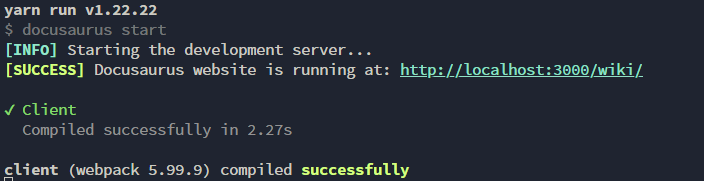

import Tabs from '@theme/Tabs';
import TabItem from '@theme/TabItem';

# ローカルでの編集方法

:::danger[気を付けてほしいこと]
本Wikiはソースコードも含め全て一般に公開されており，全く秘匿性はありません．  
そのため，個人情報の取扱いに十分注意し，公開しても問題ない情報だけを記述することに注意する．
:::

<Tabs>
  <TabItem value="local" label="ローカル環境" default>
    ## 目的
    ローカルでWikiを編集できるようになる．

    <br />
    ## 前提条件
    Windowsの場合は，WSLがインストールされていること．  
    Mac，Linuxの場合は特にない．

    <br />
    ## 初回のセットアップ手順
    ### Homebrewのインストール
    > Homebrewのインストールページ：https://brew.sh/ja/
    
    :::info[Homebrew以外のパッケージ管理ツールを使う場合]
    `apt`や`pacman`などでパッケージ管理を行う場合，この章を飛ばしてもよい．  
    その場合，以降のパッケージインストール手順は自身の環境に合わせて行うこと．
    :::

    パッケージ管理ツールとして，個人的にHomebrewをお勧めする．  
    そのため，まずはHomebrewのインストール方法を説明する．

    Homebrewは，任意のターミナル(Windowsの場合はWSL)上で[公式ページ](https://brew.sh/ja/)に書いてあるコマンドを実行するとインストールできる．  
    (本ページ作成時点では，以下のコマンドであった．)
    ```shell
    /bin/bash -c "$(curl -fsSL https://raw.githubusercontent.com/Homebrew/install/HEAD/install.sh)"
    ```
    インストール後は，`Next Step`に書いてあることを1つずつ実行していく．  
    これでパスが通り，brewが使えるようになる．  
    以下のコマンドを実行してバージョンが出力されればインストール完了である．
    ```shell
    brew --version
    ```

    <br />
    ### Node.jsのインストール
    [Node.js](https://nodejs.org/ja)は，オープンソースのJavaScriptの実行環境である．  
    Docusaurus(本Wiki)の実行にもNode.jsを使用するため，インストールする．

    以下のコマンドを実行して，インストールする．
    ```shell
    brew install node
    ```
    以下のコマンドでバージョンが出力されればインストール完了である．
    ```shell
    node --version
    ```

    <br />
    ### yarnのインストール
    [Node.js](https://nodejs.org/ja)をインストールすればおそらく同時に[npm](https://www.npmjs.com/)もインストールされていて，これでもモジュールやパッケージのインストール，Docusaurus関連のコマンドの実行は可能であるが，[yarn](https://yarnpkg.com/)の方が(少しだけだが)動作が速いという噂があるため，ここでは[yarn](https://yarnpkg.com/)をインストールする．  
    （アイコンの猫もかわいいし，ね）

    以下のコマンドを実行して，インストールする．
    ```shell
    brew install yarn
    ```
    以下のコマンドでバージョンが出力されればインストール完了である．
    ```shell
    yarn --version
    ```

    <br />
    ### Wikiリポジトリのクローン
    :::info[Gitの設定]
    Git関係の設定については，Gitに関するドキュメントを参照すること．
    :::
    Wikiリポジトリをクローンしていない場合は，ここでクローンしておく．  

    <details>
      <summary>Homebrewでgitをインストールする場合</summary>

      以下のコマンドを実行する．
      ```
      brew install git
      ```
    </details>

    以下のコマンドを実行して，クローンを行う．
    <Tabs>
      <TabItem value="html-clone" label="html" default>
        ```
        git clone https://github.com/G-2-yama/wiki.git
        ```
      </TabItem>
      <TabItem value="html-ssh" label="ssh">
        ```
        git clone git@github.com:G-2-yama/wiki.git
        ```
      </TabItem>
    </Tabs>

    <br />
    ### 依存パッケージのインストール
    続いて，package.jsonの中身(Docusaurusのビルドに必要な依存関係)をインストールする．  

    まずは，クローンしたリポジトリに入る．  
    （前章でクローンしたのであれば，`cd wiki`でリポジトリに入る．）

    リポジトリのルート（package.jsonやdocusaurus.config.tsがあるディレクトリ）であることを確認して，以下のコマンドを実行する．
    ```
    yarn
    ```
    暫く待つと，依存関係のインストールが完了する．

    <br />
    ## 編集手順
    :::info[確認]
    本章は，[セットアップ](#初回のセットアップ手順)が完了していることを前提としている．
    :::
    ### ローカルホストの起動
    ローカルホストでアプリを起動することで，ファイルの変更を保存したらすぐにWebブラウザ上で見た目を確認することが出来る．  
    そのため，ローカルホストでアプリを起動して確認しながら作成することを勧める．

    ローカルホストでアプリを起動するには，リポジトリのルートディレクトリ（package.jsonやdocusaurus.config.tsがあるディレクトリ）で以下のコマンドを実行する．
    ```
    yarn start
    ```
    しばらく経つと，以下のようなログが出る．  
    

    この状態で`http://localhost:3000/wiki/`を開けば，Wikiをプレビューすることが出来る．  
    （自分で開かなくても，おそらくデフォルトのWebブラウザが自動で開く．自動で開かない場合は自分でアクセスする．）

    ### 編集
    実際に編集を行う．

    <Tabs>
      <TabItem value="edit-docs" label="Docs" default>
        wiki直下のdocsディレクトリ内に任意のディレクトリやファイルを配置すれば，自動でWikiに追加される．  

        - ファイルの形式は，`md`または`mdx`．
        - ディレクトリを作成するときは，`_category_.json`を他のディレクトリからコピーし，`label`などの項目を変更する．（`label`は，Wikiのサイドバーなどのタイトルになる．）  
          - 方針が変わる可能性あり
        - ファイル名は原則英語で，チェインケース（命名規則のドキュメント参照．`this-is-file-name.md`みたいなやつ）とする．
        - 画像を挿入するときは，同ディレクトリ内に`img/`ディレクトリを作成し，管理しやすいようにする．
      </TabItem>
      <TabItem value="edit-label" label="Blog">
        wiki直下のblogディレクトリ内に任意のディレクトリやファイルを配置すれば，自動でWikiに追加される．  
        - ファイルの形式は，`md`または`mdx`．
        - ファイルの先頭には，以下のようなfrontmatter（メタデータ）を記述する．
          ```
          ---
          slug: welcome
          title: Welcome
          authors: [slorber, yangshun]
          tags: [facebook, hello, docusaurus]
          ---
          ```
        - ファイル名は原則英語で，チェインケース（命名規則のドキュメント参照．`this-is-file-name.md`みたいなやつ）とする．
        - 画像を挿入するときは，同ディレクトリ内に`img/`ディレクトリを作成し，管理しやすいようにする．
        - authors.ymlの著者情報は適宜更新し，絶対に秘匿すべき個人情報は含めない．
        - tags.ymlは適宜更新する．
      </TabItem>
    </Tabs>

    ### Wikiへの反映
    編集を終えたら，以下のようなコマンドでリポジトリをリモートにpushする．  
    （gitコマンド詳細については，該当するドキュメントを参照）
    :::warning[gitの運用について]
    wikiは特殊なリポジトリであるために，mainへの直接のpushを許可しており，またコミットメッセージなどのルールも設けていない．  
    他のリポジトリに関しては，そのプロジェクトの規約に従うこと．
    :::
    1. ステージング
      ```
      git add .
      ```
    2. コミット
      ```
      git commit -m "<任意のコミットメッセージ>"
      ```
    3. プッシュ
      ```
      git push
      ```
    GitHub Actionsによって，mainへのpushがトリガーになって自動でデプロイをするようになっているため，これで編集は完了である．  
    （GitHub Actionsでエラーが出た場合は原因を特定し，対応すること．）

  </TabItem>
  <TabItem value="devcontainer" label="devcontainer">
    執筆中

    バグが存在するため，一旦はローカル環境で編集するか，GitHub上で直接編集することを進める．

    バグの内容：
    - ホットリロードが効かない．
  </TabItem>
</Tabs>
