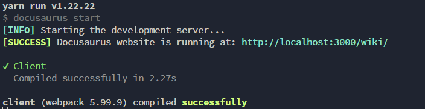

import Tabs from '@theme/Tabs';
import TabItem from '@theme/TabItem';

# ローカルでの編集方法
本記事は，ローカルでG^2 Wikiの編集が行えるようになることを目的としている．

:::danger[気を付けてほしいこと]
本Wikiはソースコードも含め全て一般に公開されており，全く秘匿性はありません．  
そのため，個人情報の取扱いに十分注意し，公開しても問題ない情報だけを記述することに注意する．
:::

## 前提条件
[環境のセットアップ](./setup.mdx)が完了していること．

## 手順
### ローカルホストの起動
ローカルホストでアプリを起動することで，ファイルの変更を保存したらすぐにWebブラウザ上で見た目を確認することが出来る．  
そのため，ローカルホストでアプリを起動して確認しながら作成することを勧める．

ローカルホストでアプリを起動するには，リポジトリのルートディレクトリ（package.jsonやdocusaurus.config.tsがあるディレクトリ）で以下のコマンドを実行する．
```
yarn start
```
しばらく経つと，以下のようなログが出る．  


この状態で`http://localhost:3000/wiki/`を開けば，Wikiをプレビューすることが出来る．  
（自分で開かなくても，おそらくデフォルトのWebブラウザが自動で開く．自動で開かない場合は自分でアクセスする．）

### 編集
実際に編集を行う．

<Tabs>
  <TabItem value="edit-docs" label="Docs" default>
    wiki直下のdocsディレクトリ内に任意のディレクトリやファイルを配置すれば，自動でWikiに追加される．  

    - ファイルの形式は，`md`または`mdx`．
    - ディレクトリの構造がそのままサイドバーやURLの階層構造になる．
    - ディレクトリを作成するときは，`_category_.json`を他のディレクトリからコピーし，`label`などの項目を変更する．（`label`は，Wikiのサイドバーなどのタイトルになる．）  
      - 方針が変わる可能性あり
    - ファイル名は原則英語で，チェインケース（命名規則のドキュメント参照．`this-is-file-name.md`みたいなやつ）とする．
    - 画像を挿入するときは，同ディレクトリ内に`img/`ディレクトリを作成し，管理しやすいようにする．
  </TabItem>
  <TabItem value="edit-label" label="Blog">
    wiki直下のblogディレクトリ内に任意のディレクトリやファイルを配置すれば，自動でWikiに追加される．  
    - ファイルの形式は，`md`または`mdx`．
    - ファイルの先頭には，以下のようなfrontmatter（メタデータ）を記述する．
      ```
      ---
      title: Welcome
      authors: [slorber, yangshun]
      tags: [facebook, hello, docusaurus]
      ---
      ```
    - ファイル名は原則英語で，チェインケース（命名規則のドキュメント参照．`this-is-file-name.md`みたいなやつ）とする．
    - 画像を挿入するときは，同ディレクトリ内に`img/`ディレクトリを作成し，管理しやすいようにする．
    - authors.ymlの著者情報は適宜更新し，絶対に秘匿すべき個人情報は含めない．
    - tags.ymlは適宜更新する．
  </TabItem>
</Tabs>

### Wikiへの反映
編集を終えたら，以下のようなコマンドでリポジトリをリモートにpushする．  
（gitコマンド詳細については，該当するドキュメントを参照）
:::warning[gitの運用について]
wikiは特殊なリポジトリであるために，mainへの直接のpushを許可しており，またコミットメッセージなどのルールも設けていない．  
他のリポジトリに関しては，そのプロジェクトの規約に従うこと．
:::
1. ステージング
  ```
  git add .
  ```
2. コミット
  ```
  git commit -m "<任意のコミットメッセージ>"
  ```
3. プッシュ
  ```
  git push
  ```
GitHub Actionsによって，mainへのpushがトリガーになって自動でデプロイをするようになっているため，これで編集は完了である．  
（GitHub Actionsでエラーが出た場合は原因を特定し，対応すること．）
